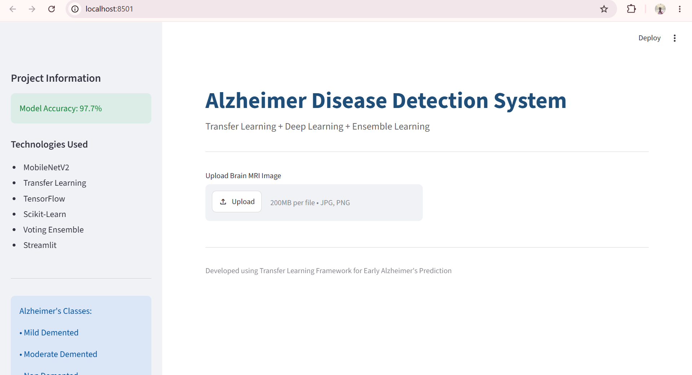
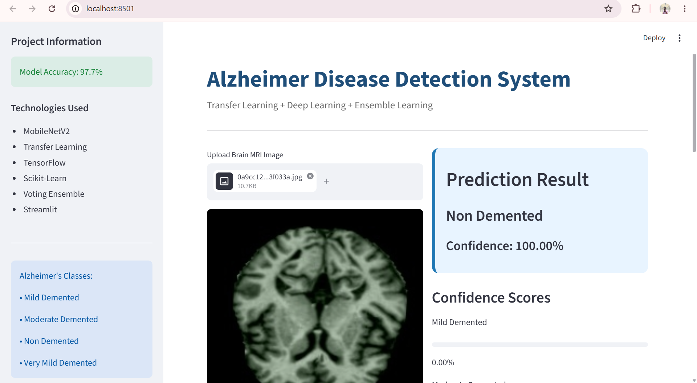
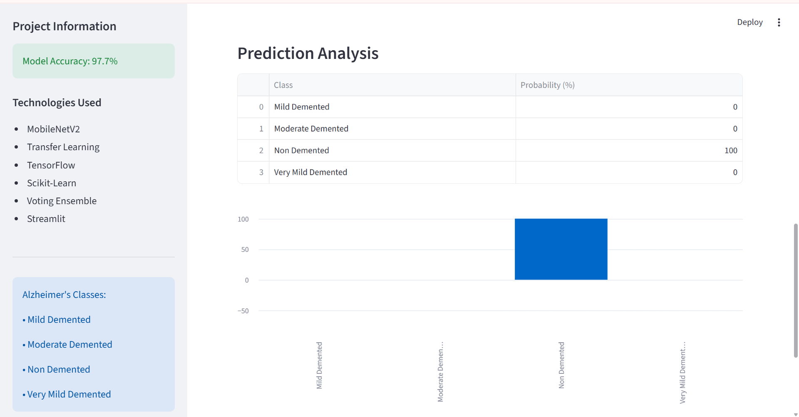
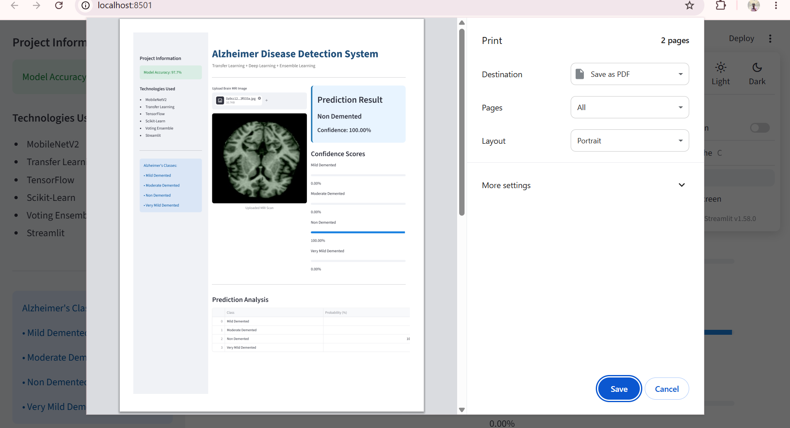

#  Transfer Learning Framework for Early Alzheimer's Disease Prediction

A Deep Learning and Ensemble Machine Learning framework for early detection of Alzheimer's Disease using Brain MRI images.

---

##  Project Overview

This project utilizes Transfer Learning with MobileNetV2 and ResNet50 to extract deep features from MRI scans and combines multiple machine learning models through Ensemble Learning for highly accurate Alzheimer's disease classification.

The system classifies MRI scans into:

- Mild Demented
- Moderate Demented
- Non Demented
- Very Mild Demented

---

##  Objectives

- Early Alzheimer's detection
- Deep feature extraction using pre-trained CNN models
- Ensemble Machine Learning classification
- Healthcare-focused predictive analytics
- Streamlit deployment for real-time predictions

---


## Project Architecture

```text
MRI Image
    ↓
Image Preprocessing
    ↓
MobileNetV2 / ResNet50
    ↓
Deep Feature Extraction
    ↓
SVM + Random Forest + Gradient Boosting
    ↓
Voting Ensemble
    ↓
Prediction
```

---

##  Dataset

Dataset Used:

Augmented Alzheimer's MRI Dataset

Classes:

| Class | Images |
|---------|---------|
| Mild Demented | 896 |
| Moderate Demented | 64 |
| Non Demented | 3200 |
| Very Mild Demented | 2240 |

Total Images: 6400+

---

##  Deep Learning Models

### MobileNetV2

- Transfer Learning
- Fine Tuning
- Input Size: 224x224

Results:

- Training Accuracy: 95.8%
- Validation Accuracy: 95.3%

---

### ResNet50

- Transfer Learning
- Fine Tuning

---

##  Ensemble Learning Models

- Support Vector Machine (SVM)
- Random Forest
- Gradient Boosting
- Voting Ensemble Classifier

Results:

| Model | Accuracy |
|---------|---------|
| SVM | 97.70% |
| Random Forest | 97.39% |
| Gradient Boosting | 97.46% |
| Ensemble | 97.70% |

---

##  Technologies Used

- Python
- TensorFlow
- Keras
- Scikit-Learn
- NumPy
- Pandas
- OpenCV
- Streamlit

---

##  Application Screenshots

## Home Page



---

## Prediction Result



---

## Prediction Analysis



---

## Prediction Analysis



---


##  Installation

Clone Repository

```bash
git clone https://github.com/bhadra0401/Alzheimer_Project.git
```

Move into Project

```bash
cd Alzheimer_Project
```

Create Virtual Environment

```bash
python -m venv venv
```

Activate Environment

```bash
venv\Scripts\activate
```

Install Dependencies

```bash
pip install -r requirements.txt
```

Run Application

```bash
streamlit run app.py
```

---

##  Results

Final Ensemble Accuracy:

97.70%

Validation Accuracy (MobileNetV2):

95.32%

---

##  Future Enhancements

- Grad-CAM Visualization
- Explainable AI (XAI)
- PDF Report Generation
- Cloud Deployment
- Multi-Patient Dashboard

---

##  Author

Naga Veera Bhadra Kumar Akkala

Data Science | Machine Learning | Deep Learning
